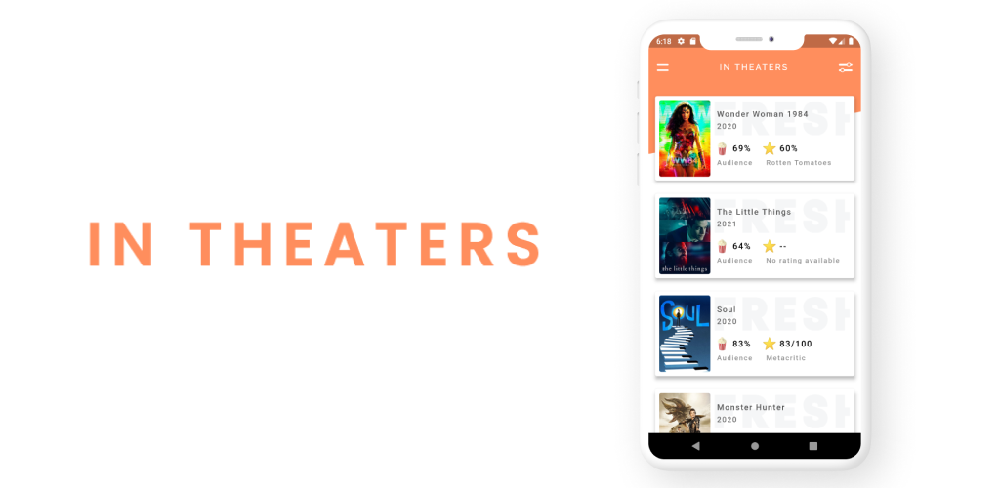
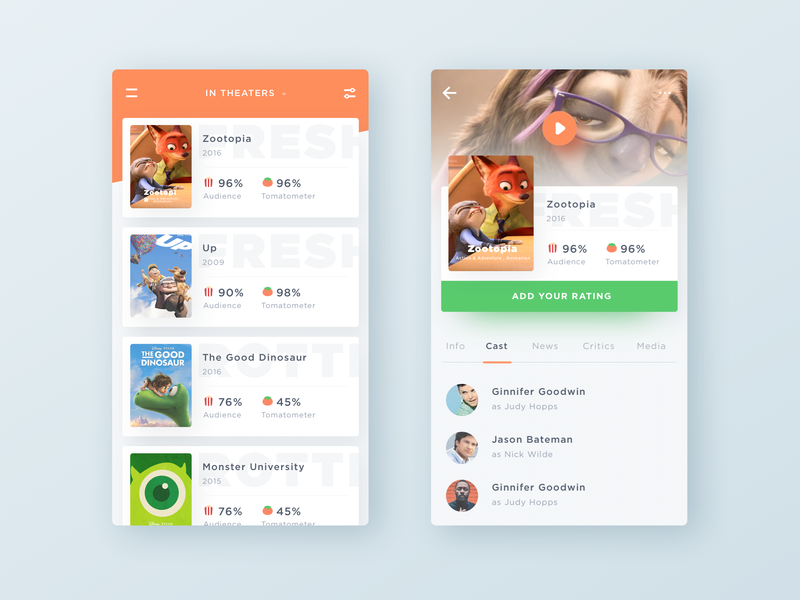

Flutter app to get rating, review and other info about movies and TV shows 🎥 (under development).

### APIs used = <a href="http://www.omdbapi.com/">omdb API</a> & <a href="https://www.themoviedb.org/">themoviedb API</a>

## UI

Trying to recreate UI designed by <a href="https://dribbble.com/shots/2784573-Rottentomatoes-App-Concept">Ghani Pradita</a> from dribbble.

### *Please note that at this time we no longer support unauthorized use of our data (e.g. unofficial projects, non-user facing data integrations).*- rottentomatoes api developer website.

Hence i had to change the *tomatometer* UI element to rating section fetched from Omdb API.

This app is still under development.
